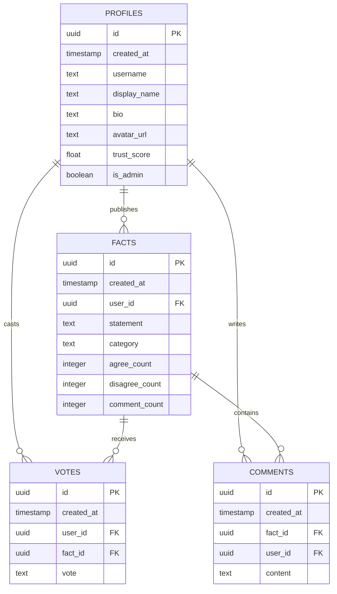

# System Architecture, User Stories & Database Specs: Factos

This document serves as the complete developer specification, system design, and architectural guide for **Factos**, a social belief feed platform built client-side.

---

## 1. Technical Stack & Technologies
* **Programming Languages & Markup:**
  * **HTML5:** Semantic markup, dynamic modal structures, localized text tags.
  * **CSS3:** Custom styling variables, responsive grid systems, GPU-accelerated mobile scroll surfaces, keyframe animations, glassmorphism design.
  * **JavaScript (ES6+):** In-place DOM render updates, optimistic consensus ratio updates, localized language dictionaries, credential storage mechanics.
* **Core Integrations:**
  * **Supabase Client SDK (CDN):** Real-time backend access directly in the browser via `https://cdn.jsdelivr.net/npm/@supabase/supabase-js@2`. Handles authentication, database queries, and score syncs.
  * **FontAwesome (CDN):** Rich visual icons for dark aesthetics.

---

## 2. Core Features & Functional Details
* **Bilingual Translation System (i18n):** Live text swaps between Spanish (default) and English for elements utilizing `data-i18n`, `data-i18n-placeholder`, and `data-i18n-title`. Swapped selections persist in `localStorage`.
* **Dynamic Feed Categories:** Filters facts dynamically by Recent Uploads (`created_at` sorting) vs. Trending Hotness (activity score sorted: votes + comments, weighted against time age).
* **Bipolar Consensus Ratio:** Visual consensus progress track showing the percentage ratio of agreement (Green) vs. disagreement (Red), updating instantly in-place.
* **Smart Inline Comment Threads:** Shows up to 5 comments by default. Collapses older comments into a expandable "View X previous comments" toggle button.
* **Base64 Avatar Uploads:** Custom user avatars encoded into Base64 data strings, stored in the database, and synced dynamically across posts and comments.
* **Trust Score Reputation System:** Calculates voter reputation dynamically. Voters gain reputation for participating (+0.5) and posting (+2.0), while post authors gain (+1.5) or lose (-2.0) based on consensus ratios (calculated after a minimum of 3 votes).
* **Gold "Top Fact" Badge:** Showcases each comment author's highest-voted statement as a gold star badge in their metadata.
* **Cascading Admin Moderation:** Administrators (`is_admin = true` profiles) can delete any facts or comments, while standard users can only delete their own comments.

---

## 3. Database Schema (Supabase / PostgreSQL)

The platform is backed by four core PostgreSQL tables. Row Level Security (RLS) is disabled for anon/guest permissions to support client-side executions.



### Key Queries
* **Feed Retrieval with Profile Joins:**
  ```javascript
  const { data: facts } = await supabaseClient
    .from('facts')
    .select('*, profiles!user_id(*)');
  ```
  *(Note: Disambiguated profile joins explicitly as `profiles!user_id(*)` to bypass PostgreSQL multiple-relation errors).*
* **Inline Comments with Profile Joins:**
  ```javascript
  const { data: comments } = await supabaseClient
    .from('comments')
    .select('*, profiles!user_id(*)')
    .eq('fact_id', factId);
  ```

---

## 4. User Stories & UX Workflows

### Visitor (Unauthenticated)
* **Story:** As a visitor, I want to connect the database and create an account or log in so I can interact with the community.
* **Workflow:** Visitor enters Supabase credentials -> connection setup persists -> visitor clicks registration -> inputs display name, username, email, password -> session saved to storage -> redirects to dashboard.

### Registered User
* **Story:** As a user, I want to vote on facts, check comments, publish statements, and edit my profile so I can express my beliefs and customize my social identity.
* **Workflow:** 
  * User clicks "De Acuerdo" -> DOM increments agree count instantly (Optimistic UI) -> issues backend `votes` insert/update -> adjusts reputation -> syncs DB Official counts -> releases input locks.
  * User expands comments -> views at most 5 inline comments + author Gold "Top Fact" badges.
  * User clicks pen icon (desktop sidebar) or user profile tab (mobile bottom nav) -> uploads custom profile picture -> inputs bio -> updates database -> updates avatar base64 globally.

### Administrator
* **Story:** As an administrator, I want to remove inaccurate facts or offensive comments so I can keep the feed civil.
* **Workflow:** Admin scrolls feed -> sees trash-can icons next to comments and facts (visible only for admin sessions) -> clicks delete -> database cascading delete triggers -> UI updates in-place.

---

## 5. Mobile Layout & UX Fixes
* **Stretched Plus Button Fix:** Placed the mobile bottom nav's middle "+" button inside a centering flex container wrapper (`bottom-nav-item-post-wrapper`) with `flex: 1`. This stops flex layouts from stretching the button vertically and keeps it a perfect circle.
* **Keyboard Focused Auto-Zoom Fix:** Overrode input control, textarea, and select text sizes to a minimum of `16px` on screens below `900px` to prevent iOS zoom shifts on focus.
* **Scrolling Performance (Hardware Acceleration):** Disabled CSS `backdrop-filter: blur(...)` inside `.glass-panel` cards on screens below `900px` and replaced them with solid colors (`background: hsl(224, 25%, 12%)`). This bypasses slow CPU-based backdrop blurs, securing **60fps/120fps scrolling on iPhone/iPad**.
